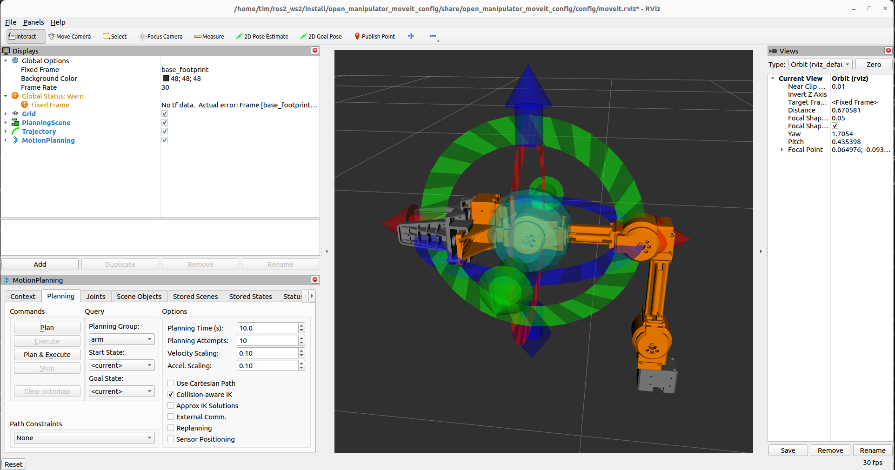

# OpenManipulatorX for use with MoveIt2

## Introduction

Work in progress...

[ROBOTIS' Open-manipulator-X](https://github.com/ROBOTIS-GIT/open_manipulator/tree/humble-devel) repository [does support MoveIt for ROS1, but not MoveIt2 for ROS2](https://emanual.robotis.com/docs/en/platform/openmanipulator_x/ros_controller_experiment/#moveit)

[ROBOTIS' Turtlebot3 manipulation](https://github.com/ROBOTIS-GIT/turtlebot3_manipulation) repository is more up-to-date and [supports MoveIt2 for ROS2](https://emanual.robotis.com/docs/en/platform/turtlebot3/manipulation/#manipulation), but depends on a Turtlebot3.

This is a fork of the [ROBOTIS' Turtlebot3 manipulation](https://github.com/ROBOTIS-GIT/turtlebot3_manipulation) repository, \
with all `turtlebot3_manipulation` renamed to `open_manipulator` and all references to Turtlebot3 removed.

It works for both `U2D2` and `openCR` controllers.

More documentation: [Manipulation with Turtlebot3](https://emanual.robotis.com/docs/en/platform/turtlebot3/manipulation/#bringup)

## Prerequisites

- ROS2 Humble

## Installation

Clone repository:
```
cd ~/ros2_ws/src
git clone https://github.com/timassman/open_manipulator_moveit2.git
```
Build repository:

```
cd ~/ros2_ws
```

On your robot, when using ARM chip, gazebo is not available (and not needed):
```
rosdep install -i -r --from-path src --rosdistro humble -y --skip-keys="gazebo_ros"
```
Otherwise, on your remote pc:
```
rosdep install -i -r --from-path src --rosdistro humble -y 
```

Build the workspace:
```
colcon build
```

Source the environment:
``` 
source ~/ros2_ws/install/local_setup.bash
```

## Real hardware

### On your robot

```
ros2 launch open_manipulator_bringup hardware.launch.py
```

### On remote pc

```
ros2 launch open_manipulator_moveit_config moveit_core.launch.py
```

Should show:



